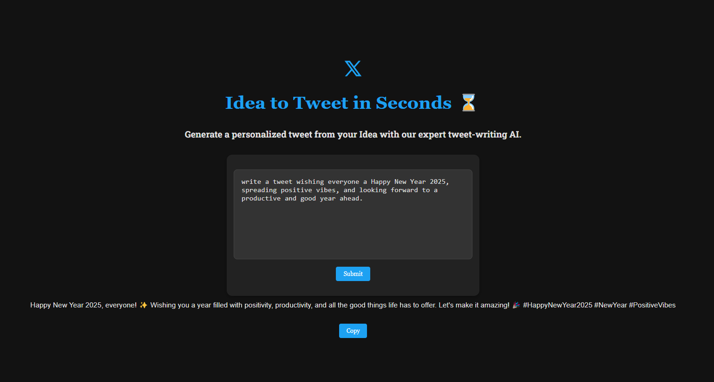

# Tweet Generator

A web app that allows users to generate tweets based on a description or idea. The app uses Google Gemini's Generative AI model to craft concise and engaging tweets, enabling a streamlined creative process.

## Tech Stack
- **Frontend**: React, TailwindCSS, React Icons
- **Backend**: Next.js API routes
- **AI Integration**: Gemini 1.5 Flash

## Contact:
GitHub: [arindal1](https://github.com/arindal1)  
LinkedIn: [arindalchar](https://www.linkedin.com/arindalchar/)  
Twitter: [arindal_17](https://twitter.com/arindal_17)  

**PS:** Made this to learn NextJs, feel free to learn and experiment around through it.